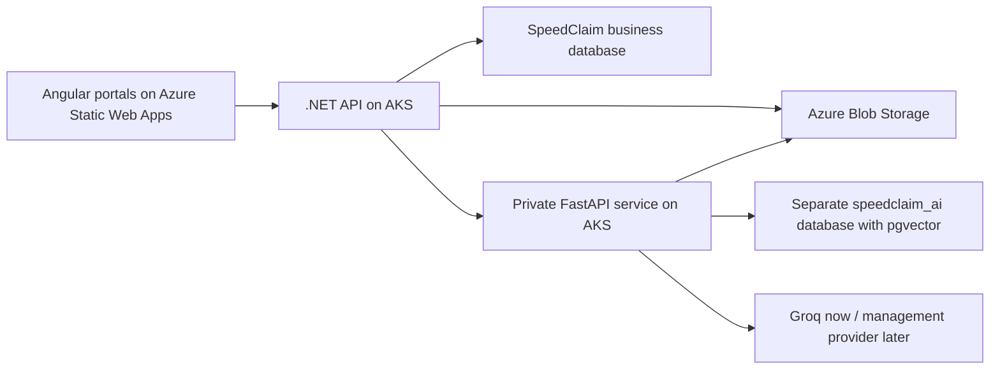

# SpeedClaim AI Features — Architecture and Implementation Plan

> **Historical planning record.** The private FastAPI service, brochure RAG, and Speedy customer workspace now exist. The current operational source is [the AI-service README](../ai-service/README.md); the external MCP connector remains disabled and is governed by [the MCP architecture](mcp-architecture.md). References below to Groq, handoff dates, and unfinished phases describe the original proposal, not the deployed/current configuration.

> **Execution update — 2026-07-15:** Policy brochure RAG is now the complete first
> implementation milestone. Grievance AI is deferred until brochure RAG is finished. The
> document-checklist work does not functionally block RAG because RAG indexes only
> admin-managed brochures, not customer-submitted proposal or claim documents. Use
> `docs/policy-brochure-rag-implementation-plan.md` as the detailed execution source for the
> first milestone.

## 1. Objective

Add two advisory AI capabilities without weakening SpeedClaim's existing authorization,
workflow, audit, or financial controls:

1. **Policy brochure Q&A** — answer questions from a versioned, text-based PDF brochure,
   with the answer grounded in the exact brochure version applicable to the policy.
2. **Grievance triage summary** — generate a small, structured summary only when an
   authorized Claims Officer explicitly requests it.

The .NET API remains the public backend and source of truth. The Python service performs
document ingestion, retrieval, and inference, but it never changes a proposal, policy,
claim, grievance status, assignment, approval, settlement, or payment.

## 2. Confirmed Product Decisions

### 2.1 Policy brochure Q&A

- Brochures are text-based PDFs only. Scanned PDFs, OCR, Word documents, and images are out
  of scope.
- Admin is the only role that uploads and publishes brochure versions.
- A brochure belongs to an `InsuranceProduct`.
- A policy is permanently bound to the brochure version that was published when the policy
  was issued.
- Publishing a newer brochure never changes the brochure used by an older policy.
- Customer Q&A initially targets issued policies and their bound brochures.
- The architecture may also support pre-purchase Q&A against the product's current published
  brochure, but exposing anonymous/public Q&A is a later decision.
- Endorsement questions are answered only when the brochure states which changes are allowed
  or disallowed. Live endorsement request state remains ordinary .NET data.
- English only for the first release.
- Every substantive answer must use retrieval. The model must not answer policy questions
  from general model knowledge.
- Every answer must include brochure evidence such as page number and section title.
- If evidence is insufficient, the assistant must say that the answer was not found in the
  applicable brochure.

### 2.2 Premium questions

- The model must not calculate an authoritative premium.
- Existing deterministic .NET premium calculation remains authoritative.
- Initial implementation may explain rates or a calculation returned by .NET.
- Conversational premium-calculator tool calling is post-MVP. A conventional calculator UI
  should be preferred first.

### 2.3 Grievance triage

- AI runs only after a Claims Officer clicks **Generate AI summary**.
- Attachments are never sent to the AI service.
- No OCR or attachment parsing is included.
- English only for the first release.
- Minimum structured output:
  - concise summary;
  - suggested category;
  - suggested priority (`Normal`, `High`, or `Urgent`);
  - missing information, if any.
- The existing customer-selected category remains unchanged unless a human changes it
  through an authorized .NET workflow.
- Draft customer replies are post-MVP.
- AI must not assign an officer, change grievance status, resolve/close the grievance, send
  email, or write resolution notes automatically.

## 3. Relationship to SivaSabari's Document Checklist Work

The AI features are possible without the checklist implementation. The checklist and the AI
features share product/admin UI and EF Core integration surfaces, but they do not share their
core domain concepts.

The checklist design and ownership remain documented in
`docs/kt-document-checklist-timeline.md`. The AI implementation must not pre-build or replace
that design.

### 3.1 Safe to implement before the checklist handoff

- Python FastAPI service scaffold and tests.
- Groq inference adapter.
- Provider-neutral chat interface.
- Local embedding adapter.
- PDF extraction with page preservation.
- Heading-aware chunking and citation metadata.
- Separate pgvector repository and AI-database migrations.
- Brochure ingestion endpoint in Python.
- Brochure retrieval/Q&A endpoint in Python.
- Grievance summarization endpoint in Python.
- Pydantic input/output contracts.
- Dockerfile, health endpoints, logging, timeouts, and retry behavior.
- .NET/Python JSON contract documentation.
- A .NET typed HTTP client and DTOs, provided they do not require changing product,
  checklist, proposal-document, or claim-document models.

### 3.2 Wait until SivaSabari's work is available

- Changes to `admin-products.ts` or `admin-products.html`.
- Changes to `DocumentRequirement` or `SubmittedDocument`.
- Proposal or claim document-checklist UI changes.
- Product DTO changes that overlap his branch.
- The final EF Core migration for `ProductBrochure`, the policy brochure foreign key, and
  persisted grievance summaries.
- `SpeedClaimDbContext` model-snapshot changes. Concurrent EF migrations are possible, but
  waiting avoids a predictable snapshot conflict during the handoff.

### 3.3 Integration procedure after the handoff

1. Inspect SivaSabari's branch/commit and `git diff` before modifying overlapping files.
2. Re-run backend and frontend contract searches for product, requirement, proposal, claim,
   and submitted-document types.
3. Preserve his catalog/checklist model; do not merge brochure data into document
   requirements.
4. Add brochures as a separate product-owned concept.
5. Create new EF migrations only after the combined model compiles.
6. Run focused checklist tests as well as AI integration tests to detect regressions.

## 4. Target Architecture



### 4.1 Trust boundaries

- Angular calls only the .NET API.
- Python has no public ingress.
- .NET authenticates the human, validates role and entity access, and prepares the smallest
  permitted AI request.
- Python validates an internal service credential before accepting requests.
- Python can read brochure blobs and write only to the separate AI database.
- Python has no credentials for the SpeedClaim business database.
- .NET alone writes brochure publication state, policy bindings, and grievance AI-summary
  records to the business database through `IUnitOfWork`/repositories.
- The LLM receives retrieved brochure excerpts or redacted grievance context, never a broad
  database dump.

## 5. Provider Strategy

Inference must be behind an application-owned interface rather than Groq-specific business
logic.

```text
ChatCompletionProvider
  - GroqChatCompletionProvider
  - FutureManagementProvider

EmbeddingProvider
  - LocalSentenceTransformerEmbeddingProvider
  - FutureManagedEmbeddingProvider

VectorRepository
  - PgVectorRepository
```

Configuration names should be provider-neutral where possible:

```text
AI__ChatProvider
AI__ChatBaseUrl
AI__ChatModel
AI__ChatApiKey                 # secret
AI__EmbeddingProvider
AI__EmbeddingModel
AI__EmbeddingDimension
AI__RequestTimeoutSeconds
AI__MaxRetrievedChunks
AI__MinimumRetrievalScore
```

The chat API key belongs in Azure Key Vault and must never be committed, returned to Angular,
or written to logs.

Changing the embedding model requires re-embedding all brochure chunks. Every indexed
document must therefore record its embedding provider, model, dimension, and content hash.

## 6. Storage Strategy

### 6.1 Business database

The existing SpeedClaim PostgreSQL database remains the source of truth for:

- brochure metadata and publication lifecycle;
- the brochure version bound to a policy;
- authorized AI-run audit metadata;
- an optionally persisted grievance AI summary and its human review metadata.

Only .NET writes these records.

### 6.2 AI/vector database

Create a separate `speedclaim_ai` database on the existing Azure PostgreSQL Flexible Server,
with a separate least-privilege user and the `vector` extension enabled.

Initial tables:

```text
rag_documents
  id
  brochure_id
  product_id
  brochure_version
  blob_path
  content_hash
  page_count
  embedding_provider
  embedding_model
  embedding_dimension
  indexed_at

rag_chunks
  id
  document_id
  parent_chunk_id              # nullable; supports parent/child retrieval
  page_number
  section_title
  chunk_index
  content
  content_hash
  token_count
  embedding vector(n)

rag_ingestion_runs
  id
  brochure_id
  status
  started_at
  completed_at
  page_count
  chunk_count
  error_code
  error_message_redacted
```

Do not store grievance text or customer PII in the vector database.

### 6.3 Blob storage

- Original brochures remain in the existing private Azure Blob container.
- Store brochures under a versioned key such as
  `uploads/product-brochures/{productId}/{brochureId}/{filename}`.
- Replacing a published brochure in place is prohibited. A content change creates a new
  brochure version and blob key.

### 6.4 Chroma and Pinecone

- Chroma may be used only as an optional local-development adapter. It is not the Azure
  production store because pod-local state is replaceable and does not support clean
  multi-replica operation.
- Pinecone is a fallback only if pgvector cannot be enabled. It adds another vendor, secret,
  region, data-retention boundary, and failure dependency.

## 7. Proposed Business Data Model

The final names can be adjusted to match the combined EF model after the checklist handoff.

### 7.1 `ProductBrochure`

```text
Id
ProductId
Version
OriginalFilename
BlobPath
MimeType
FileSizeKb
ContentHash
Status                 Draft | Processing | Published | Failed | Archived
EffectiveFrom
EffectiveTo            nullable
CreatedById
PublishedById          nullable
CreatedAt
PublishedAt            nullable
IngestionErrorCode     nullable; no raw stack trace
```

Constraints:

- unique `(ProductId, Version)`;
- only one currently published brochure per product/effective interval;
- published brochures are immutable;
- a brochure cannot be published until ingestion succeeds;
- a brochure referenced by any policy cannot be deleted;
- archive instead of deleting historical versions.

### 7.2 Policy binding

Add nullable `Policy.ProductBrochureId` initially for migration/backfill safety. New policy
issuance must require the current successfully indexed brochure after rollout is enabled.

For existing policies created before the feature:

- bind them deliberately through a one-time administrative backfill; or
- show "No brochure version was bound to this policy" and keep Q&A unavailable.

Do not silently bind old policies to the newest brochure.

### 7.3 Grievance AI summary

Prefer a separate table over adding many AI fields to `Grievance`:

```text
GrievanceAiSummary
  Id
  GrievanceId
  RequestedById
  Summary
  SuggestedCategory
  SuggestedPriority
  MissingInformationJson
  ModelProvider
  ModelName
  PromptVersion
  GeneratedAt
  ReviewedById          nullable
  ReviewedAt            nullable
```

The summary is advisory. Generating it must not mutate `Grievance.Category`, `Status`,
`AssignedToId`, or `ResolutionNotes`.

### 7.4 AI audit metadata

Use existing semantic `AuditLog` entries for actions such as:

- `ProductBrochureUploaded`
- `ProductBrochurePublished`
- `PolicyAssistantQueried`
- `GrievanceAiSummaryGenerated`

Do not put raw questions, answers, brochure chunks, grievance descriptions, or PII into
`AuditLog.OldValue`/`NewValue`. Store entity IDs, model/prompt version, outcome, latency,
token counts, and hashes only.

## 8. Proposed HTTP Contracts

Exact route names should be finalized during implementation against the existing controller
conventions.

### 8.1 Angular to .NET

```text
POST /api/v1/products/{productId}/brochures
  Role: Admin
  Body: multipart PDF + version/effective date metadata

GET /api/v1/products/{productId}/brochures
  Role: Admin, Underwriter

PUT /api/v1/products/{productId}/brochures/{brochureId}/publish
  Role: Admin

POST /api/v1/policies/{policyId}/assistant/questions
  Role: Customer, Underwriter, Admin
  Customer access: must own the policy
  Body: { question }
  Returns: { answer, citations[], brochureVersion, evidenceStatus, requestId }

POST /api/v1/grievances/{grievanceId}/ai-summary
  Role: ClaimsOfficer, Admin
  Body: empty or { regenerate: false }
  Returns: structured grievance summary
```

Potential post-MVP route:

```text
POST /api/v1/products/{productId}/assistant/questions
  Current published brochure; public/authentication decision still open
```

### 8.2 .NET to Python internal API

```text
POST /internal/v1/brochures/ingest
  { brochureId, productId, version, blobPath, contentHash }

DELETE /internal/v1/brochures/{brochureId}/index
  Archive/re-index maintenance only; must not delete policy metadata

POST /internal/v1/policy-qa
  { requestId, actorRole, productId, brochureId, brochureVersion, question }

POST /internal/v1/grievances/summarize
  { requestId, category, description, policyContext?, claimContext? }
```

Python responses use strict Pydantic schemas. Python returns no business-state command or
"recommended status transition" field.

## 9. Request Flows

### 9.1 Brochure upload and publication

1. Admin uploads a text-based PDF to .NET.
2. .NET validates role, extension, MIME type, size, and basic PDF signature.
3. .NET calculates a SHA-256 content hash and uploads the PDF to Blob Storage.
4. .NET creates a Draft/Processing `ProductBrochure` record and audit entry.
5. .NET asks Python to ingest the brochure.
6. Python downloads the private blob using its Azure identity.
7. Python extracts text page by page and rejects empty/image-only documents.
8. Python creates heading-aware child chunks plus larger parent context chunks.
9. Python embeds and writes chunks to `speedclaim_ai` in one replaceable ingestion run.
10. Python returns page/chunk counts and the embedding model used.
11. .NET marks the brochure ready for publication.
12. Admin explicitly publishes it.

MVP ingestion may be synchronous for small brochures. If latency becomes unacceptable,
replace the internal call with a background job/outbox without changing the public API.

### 9.2 Policy question

1. Angular sends `policyId` and question to .NET.
2. .NET authenticates the actor and verifies ownership/role access.
3. .NET resolves the policy's immutable `ProductBrochureId`.
4. .NET sends only the brochure identity and question to Python.
5. Python embeds the question and filters retrieval by exact `brochureId`.
6. Python retrieves child chunks and expands the selected parent context.
7. Python sends the bounded evidence to the configured chat provider.
8. Python validates citations and evidence coverage.
9. Python returns the answer or an insufficient-evidence result.
10. .NET records redacted telemetry/audit metadata and returns the response to Angular.

### 9.3 Grievance summary

1. Claims Officer opens a grievance and clicks **Generate AI summary**.
2. .NET verifies the role and grievance access.
3. .NET loads only the permitted grievance, policy, and claim fields.
4. .NET/Python redacts direct identifiers before inference.
5. Python calls the configured chat provider with a strict structured-output schema.
6. Python validates the result and returns it to .NET.
7. .NET persists the advisory summary and an audit entry.
8. The UI displays an AI label, model-generated disclaimer, generation time, and regenerate
   action. It performs no workflow action.

## 10. Retrieval and Prompt Rules

### 10.1 Parsing and chunking

- Preserve page number for every text span.
- Detect headings and clause numbers where possible.
- Keep tables together where extraction permits.
- Use child chunks for precise retrieval and parent chunks for answer context.
- Never combine chunks from different brochure versions.
- Store deterministic chunk/content hashes so re-ingestion is idempotent.

### 10.2 Policy answer prompt

The system instruction must require:

- use only supplied brochure evidence;
- never infer coverage, exclusions, eligibility, premium, or endorsement permissions not
  stated in the evidence;
- distinguish brochure terms from live policy facts;
- cite page and section for each material statement;
- return insufficient evidence instead of guessing;
- never provide claim approval or legal advice.

### 10.3 Grievance prompt

The system instruction must require:

- neutral, non-judgmental summarization;
- no coverage or liability conclusion;
- no promise of payment or resolution;
- no autonomous workflow recommendation beyond the allowed priority/category fields;
- concise English output;
- all schema fields present.

Prompts must be versioned in source. Model/provider changes require rerunning evaluations.

## 11. Privacy and Security Gate

Before grievance inference is enabled outside local/test environments, management must
explicitly approve sending redacted grievance text to the selected provider.

For Groq development:

- enable Zero Data Retention if the organization permits it;
- confirm the account-level data-control setting rather than assuming it;
- never send Aadhaar, PAN, email, phone, address, access tokens, refresh tokens, document
  paths, or customer names;
- replace policy/claim numbers with neutral references unless the value is essential;
- never log raw inference requests or responses;
- apply maximum input lengths and reject prompt-injection attempts to alter system rules;
- use TLS and server-side API keys only.

Internal .NET-to-Python authentication should use a dedicated service credential initially
and move to workload identity/mTLS if required. The Python Service remains `ClusterIP` only.

## 12. Deployment Plan

### 12.1 Python workload

- Build `speedclaim-ai` as a separate container from the repository root.
- Push it to the existing Azure Container Registry.
- Deploy one FastAPI replica in the same AKS namespace as the .NET API.
- Expose port 8000 through an internal `ClusterIP` service only.
- Add `/health/live` and `/health/ready`.
- Readiness checks must verify configuration and database connectivity, but should not call
  Groq on every probe.
- Begin with an estimated 0.5–1 vCPU and 1–2 GiB memory, then adjust after measuring the local
  embedding model and PDF ingestion.
- Use separate Kubernetes service account/workload identity and least-privilege access to
  Blob Storage and Key Vault.
- Allow outbound access only to PostgreSQL, Blob/Key Vault endpoints, DNS, and the configured
  inference provider.

### 12.2 .NET integration

- Add a typed `HttpClient` for the internal AI service.
- Configure connect/request timeouts and bounded retries for transient failures.
- Do not retry non-idempotent publication blindly.
- Propagate correlation/request IDs.
- AI failure must return a feature-specific unavailable response; it must not cause policy,
  claim, proposal, grievance, authentication, or payment endpoints to fail.

### 12.3 Secrets and configuration

- Development secrets remain in ignored local configuration/environment variables.
- Production provider key and internal service credential go to Azure Key Vault.
- Kubernetes manifests contain only non-sensitive provider/model names and service URLs.
- Do not commit populated Kubernetes Secret resources.

## 13. Phased Implementation Sequence

### Phase 0 — Contracts and safety baseline (independent)

- [ ] Create the Python service directory and dependency manifest.
- [ ] Define Pydantic contracts for ingestion, policy Q&A, citations, and grievance summary.
- [ ] Define provider, embedding, vector-store, and blob-reader interfaces.
- [ ] Add configuration validation and redacted structured logging.
- [ ] Add liveness/readiness endpoints.
- [ ] Add unit-test infrastructure.

**Exit:** Service starts locally, validates configuration, and passes contract/health tests
without a Groq key.

### Phase 1 — Groq and grievance summarization core (independent)

- [ ] Implement Groq provider through the provider-neutral interface.
- [ ] Add timeout, 429/5xx retry, and provider-error mapping.
- [ ] Implement strict grievance-summary schema and prompt.
- [ ] Add identifier redaction and maximum-length validation.
- [ ] Add mocked-provider unit tests and optional manually enabled Groq smoke test.

**Exit:** Python can summarize a synthetic grievance into valid structured JSON without
reading attachments or exposing secrets.

### Phase 2 — RAG ingestion and retrieval core (independent)

- [ ] Implement text-PDF extraction with page metadata.
- [ ] Implement section-aware parent/child chunking.
- [ ] Implement local embedding provider.
- [ ] Add pgvector AI-database schema/migrations.
- [ ] Implement idempotent brochure ingestion.
- [ ] Implement brochure-filtered retrieval and insufficient-evidence behavior.
- [ ] Add parser, chunking, metadata-filter, and retrieval tests.

**Exit:** A sample brochure can be indexed and queried locally using its exact brochure ID.

### Phase 3 — Reconcile SivaSabari handoff

- [ ] Inspect and integrate his checklist changes.
- [ ] Run his focused backend/frontend tests before AI changes touch shared files.
- [ ] Resolve product DTO/admin UI/DbContext model shape.
- [ ] Confirm `EntityType` and catalog behavior remain owned by the checklist feature.
- [ ] Update this plan if his final contracts differ from the forecast.

**Exit:** Combined repository builds cleanly before adding AI business migrations.

### Phase 4 — .NET brochure domain and AI gateway

- [ ] Add `ProductBrochure` model, repository access, DTOs, validators, service, controller,
  audit actions, and tests.
- [ ] Add immutable brochure version/publication rules.
- [ ] Add policy brochure binding at issuance.
- [ ] Decide and implement explicit legacy-policy backfill behavior.
- [ ] Add the typed Python AI client.
- [ ] Add customer ownership and role authorization for policy Q&A.
- [ ] Add grievance-summary generation and optional persistence through .NET.
- [ ] Add EF migration only after the combined model is stable.

**Exit:** .NET owns authorization and business metadata; Python remains unable to write the
business database.

### Phase 5 — Angular UI

- [ ] Add an Admin brochure-version panel without disturbing the checklist selection UI.
- [ ] Add upload, processing, failed, published, and archived states.
- [ ] Add customer issued-policy assistant with citations and insufficient-evidence UI.
- [ ] Add Claims Officer **Generate AI summary** action and structured result card.
- [ ] Add loading, timeout, retry, unavailable, and rate-limit states.
- [ ] Clearly label all generated content as AI-assisted and advisory.
- [ ] Add focused Vitest coverage.

**Exit:** All AI actions are explicit, role-correct, and degrade safely.

### Phase 6 — Evaluation and Azure deployment

- [ ] Build a small approved brochure Q&A evaluation set with answer citations.
- [ ] Build synthetic grievance cases for summary/category/priority evaluation.
- [ ] Test prompt injection, unrelated questions, missing evidence, and provider outage.
- [ ] Build/push the Python image to ACR.
- [ ] Deploy FastAPI and internal service to AKS.
- [ ] Add Key Vault configuration and workload identity.
- [ ] Enable/verify pgvector on the separate AI database.
- [ ] Run local, integration, deployed smoke, and failure-path tests.
- [ ] Verify live image tags and pod resources before reporting deployment complete.

**Exit:** Deployed feature passes acceptance tests without exposing Python publicly.

### Post-MVP

- [ ] Pre-purchase product Q&A.
- [ ] Conversational wrapper around deterministic premium calculation.
- [ ] Draft grievance response with a separate human approval gate.
- [ ] Asynchronous brochure-ingestion queue/outbox.
- [ ] Reranking/corrective retrieval only if evaluation data proves it is necessary.
- [ ] Multilingual support.

## 14. Testing and Evaluation Strategy

### 14.1 Python tests

- Configuration and secret-redaction tests.
- Pydantic schema validation.
- PDF rejection tests for empty/image-only/corrupt files.
- Page/section preservation tests.
- Deterministic chunk hash and idempotent re-ingestion tests.
- Exact brochure-version metadata filtering.
- Provider timeout, 429, 5xx, invalid JSON, refusal, and unavailable tests.
- Grievance PII-redaction tests.

### 14.2 .NET tests

- NUnit/Moq patterns used by the existing project.
- Admin-only brochure upload/publication.
- Cannot publish before successful ingestion.
- Published brochure immutability.
- Policy issuance binds the current version once.
- New publication does not alter existing policy binding.
- Customer can query only their policy.
- Underwriter/Admin role access as explicitly defined.
- Grievance summary generation does not mutate grievance workflow fields.
- AI provider failure maps to a safe feature-specific response.
- Audit entries contain metadata but no raw content/PII.

### 14.3 Angular tests

- Role-specific visibility.
- Loading, success, insufficient-evidence, rate-limit, and unavailable states.
- Citation rendering.
- No automatic workflow action from generated grievance output.
- Admin cannot publish while brochure ingestion is incomplete.

### 14.4 Evaluation cases

Policy Q&A evaluation must include:

- directly stated answer;
- answer spanning two clauses;
- exclusion question;
- endorsement-permission question;
- question answered only by a different brochure version;
- missing answer;
- malicious instruction inside the question;
- question requesting a claim approval or legal conclusion.

Grievance evaluation must include synthetic examples for each category, ambiguous category,
normal/high/urgent priority, missing information, prompt injection, and descriptions containing
fake PII that must be redacted.

## 15. Acceptance Criteria

The MVP is complete only when:

1. Admin can upload, index, and publish a text PDF brochure version.
2. A newly issued policy stores one immutable brochure reference.
3. An older policy continues querying its original brochure after a newer version is
   published.
4. Customer answers cite only the bound brochure's pages/sections.
5. Missing evidence produces a clear non-answer rather than a hallucination.
6. Claims Officer can explicitly generate a structured grievance summary.
7. Summary generation neither reads attachments nor changes any grievance field.
8. Angular never calls Groq or Python directly.
9. Python has no business-database credentials and no public ingress.
10. Provider outage does not break non-AI SpeedClaim workflows.
11. Logs/audit rows contain no raw grievance text, policy questions, retrieved chunks, or PII.
12. Focused Python, backend, and frontend tests plus both development builds pass.

## 16. Known Open Decisions and Gates

- **Required before enabling grievance AI:** management approval for sending redacted
  grievance text to the chosen provider and confirmation of the provider's data-retention
  controls. For Groq, verify Zero Data Retention in the actual organization settings.
- Decide whether pre-purchase product Q&A is authenticated or anonymous.
- Obtain at least one representative brochure PDF per domain for parser and evaluation work.
- Confirm the final management inference provider and whether it supplies embeddings.
- Inspect live AKS node capacity before choosing final Python CPU/memory requests.
- Confirm the legacy-policy brochure backfill policy; never silently bind old policies to a
  current brochure.
- Revisit shared product/admin/EF details after SivaSabari's expected 2026-07-19 handoff.

## 17. Suggested Commit Boundaries

Keep implementation reviewable and avoid mixing SivaSabari's checklist changes with AI work:

1. `feat(ai): scaffold FastAPI service and contracts`
2. `feat(ai): add Groq grievance summarization`
3. `feat(ai): add brochure ingestion and pgvector retrieval`
4. `feat(ai): add brochure versioning and internal AI gateway`
5. `feat(ai): add policy assistant and grievance summary UI`
6. `feat(deploy): deploy private AI service to AKS`

Do not stage `docs/azure-deployment-plan.md` or `k8s/` unless explicitly requested. New AI
deployment manifests should be reviewed separately because those paths are currently
uncommitted deployment experiments.

## 18. Recommended Thread Handoff

Use this document as the durable source of truth, then begin implementation in a new Codex
task so the implementation context is focused and does not depend on the long brainstorming
history.

Suggested opening request:

> Read `AGENTS.md`, `CLAUDE.md`, and `docs/ai-features-implementation-plan.md`. Implement
> Phase 0 and Phase 1 only. Do not touch the checklist-owned product/document/admin paths or
> create EF migrations. Preserve the existing untracked Azure deployment files.
