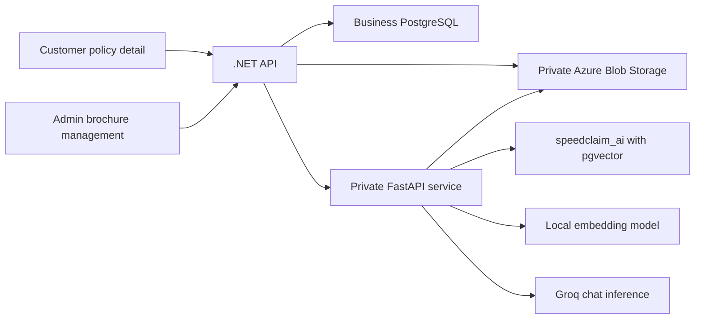
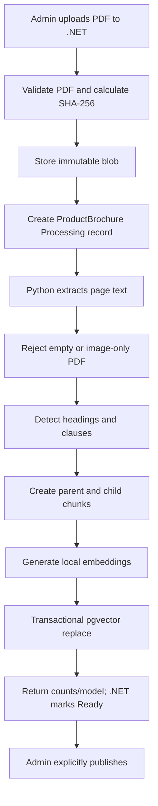
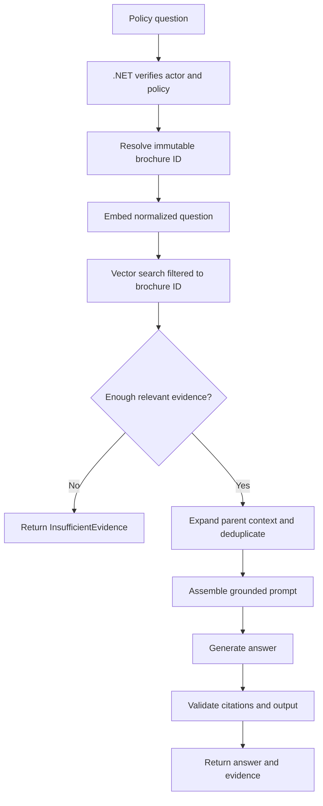

# SpeedClaim Policy Brochure RAG — Detailed Implementation Plan

> **Historical implementation plan.** The private FastAPI brochure-RAG service and the Speedy workspace are now implemented. For the current configuration, safety boundary, and verification commands, use [the AI-service README](../ai-service/README.md). The external MCP connector is intentionally disabled; see [the MCP architecture](mcp-architecture.md). Groq-specific examples below are not current configuration.

**Plan date:** 2026-07-15  
**Original milestone:** AI Milestone 1 — complete before grievance AI
**Vector store:** Separate `speedclaim_ai` PostgreSQL database using pgvector  
**Brochure format:** Text-based PDF only  
**Synthetic fixture:** `output/pdf/speedclaim-arogya-shield-plus-synthetic-brochure-v1.pdf`  

## 1. Outcome

Build a policy assistant that answers questions using only the exact brochure version
applicable to an insurance product or issued policy.

The first customer-facing release is an issued-policy assistant:

- customer opens one policy;
- SpeedClaim resolves that policy's immutable brochure version;
- Python retrieves evidence only from that brochure;
- the configured LLM produces a grounded answer;
- the UI displays page/section citations;
- insufficient evidence produces a clear non-answer.

This milestone ends when brochure upload/versioning, ingestion, retrieval, grounded answers,
citations, policy binding, Angular UI, evaluations, and Azure deployment all work end to end.
Grievance summarization begins only after this milestone is accepted.

## 2. Independence from the Document Checklist

SivaSabari's feature and brochure RAG solve different problems:

| Concern | Owner/data | AI RAG interaction |
| --- | --- | --- |
| Required proposal/claim checklist | `DocumentRequirement`, customer uploads, reviewer state | None |
| Customer-submitted proposal documents | `SubmittedDocument` with proposal entity | None |
| Customer-submitted claim documents | `SubmittedDocument` with claim entity | None |
| Product policy brochure | New `ProductBrochure`, uploaded by Admin | Indexed by RAG |
| Policy question | Policy-bound brochure version | Retrieved by RAG |

The RAG implementation must not read, index, embed, summarize, or send any customer-submitted
document to the model.

There is no functional dependency on the checklist. The only possible overlap is mechanical:

- both may add EF Core migrations and modify the DbContext model snapshot;
- both may add actions around the Admin product area.

That overlap is managed, not blocking. Brochure administration should use a separate product
action/page rather than adding fields to SivaSabari's product-creation checklist form. If two
EF migrations are created on different branches, reconcile the model snapshot after merging
and verify the combined model.

## 3. Scope

### 3.1 Included in Milestone 1

- Admin brochure upload after a product exists.
- Multiple immutable brochure versions per product.
- Explicit Admin publication/archive lifecycle.
- Text extraction from text-based PDFs.
- Page- and section-aware parent/child chunking.
- Local CPU embedding provider behind an interface.
- pgvector storage in a separate AI database.
- Exact brochure-version metadata filtering.
- Groq-backed grounded answer generation.
- Page/section citations.
- Customer issued-policy Q&A.
- Underwriter/Admin access to the same policy-bound assistant when authorized.
- Persistent, user-owned conversation history for each policy.
- Safe insufficient-evidence behavior.
- Redacted audit/telemetry metadata.
- Local and Azure deployment.

### 3.2 Explicitly excluded

- Proposal and claim document checklist work.
- Customer-submitted document ingestion.
- OCR and scanned PDFs.
- Grievance summarization.
- Web search fallback.
- Autonomous policy, proposal, endorsement, claim, or payment actions.
- LLM-calculated authoritative premiums.
- Multilingual support.
- Voice input/output.
- Fine-tuning.
- Anonymous pre-purchase Q&A unless explicitly selected before implementation.

## 4. Fixed Business Rules

1. Admin is the only role that uploads, publishes, or archives a brochure.
2. A brochure belongs to one `InsuranceProduct`.
3. Published brochure content is immutable.
4. Correcting content creates a new version and a new blob.
5. A brochure cannot be published until ingestion succeeds.
6. New policy issuance binds the current published/indexed brochure once.
7. Later brochure publication never modifies an existing policy binding.
8. Retrieval for an issued policy filters by exact `brochureId`, not merely product/domain.
9. The assistant uses brochure evidence only.
10. The assistant may explain brochure wording but cannot decide coverage, approve a claim,
    alter an endorsement, calculate an authoritative premium, or give legal advice.
11. When evidence is missing or weak, the answer is unavailable rather than inferred.
12. Angular calls .NET only. Python and Groq are never called from the browser.

## 5. User Experience Direction

### 5.1 Recommended presentation

Use a contextual **Policy Guide** inside the existing customer policy-detail screen.

- Add a sixth `Policy Guide` tab alongside Overview, Nominees, Endorsements, Schedule, and
  History.
- Add an `Ask Policy Guide` secondary/gold-accent action in the policy header near
  `Certificate`; this activates the Policy Guide tab.
- Do not open a separate browser window.
- Do not use a global floating bubble for the MVP.
- Do not present the assistant on unrelated pages where the active policy/brochure context is
  ambiguous.

Why this fits SpeedClaim:

- the existing policy page is already tab-oriented;
- the assistant is visibly bound to the policy currently being viewed;
- citations need more room than a small chat bubble provides;
- keyboard navigation and mobile responsiveness are easier;
- the interface remains quiet, dense, and trustworthy rather than looking like a generic
  consumer chatbot.

### 5.2 Desktop layout

```text
+-----------------------------------------------------------------------+
| Policy number       Product name                     [Certificate]     |
|                                                    [Ask Policy Guide]  |
+-----------------------------------------------------------------------+
| Overview | Nominees | Endorsements | Schedule | History | Policy Guide|
+------------------------------------------+----------------------------+
| POLICY GUIDE                             | SOURCES                    |
| Ask about coverage, exclusions,          | Brochure v3                |
| waiting periods, and endorsements.       | Effective 01 Jul 2026      |
|                                          |                            |
| [Guide avatar] Suggested questions       | Page 4 · Waiting period    |
|                                          | quoted evidence excerpt    |
| Customer question                        |                            |
| Assistant answer with [1] [2] markers    | Page 11 · Exclusions       |
|                                          | quoted evidence excerpt    |
| [ Type your policy question...      ][→] |                            |
+------------------------------------------+----------------------------+
```

Suggested proportions: conversation 62%, evidence rail 38%. The evidence rail collapses
below the conversation on smaller screens.

### 5.3 Mobile layout

```text
+-------------------------------+
| Policy Guide · Brochure v3     |
| [Guide avatar]                 |
| Suggested questions            |
|                               |
| Conversation                  |
|                               |
| Sources for latest answer     |
| Page 4 · Waiting period       |
| Page 11 · Exclusions          |
|                               |
| [ Ask a question...       ][→]|
+-------------------------------+
```

The composer stays visible near the bottom of the tab but must not obscure citations or
browser accessibility controls.

### 5.4 Interaction states

The component must design these states deliberately:

- brochure unavailable for this legacy policy;
- brochure ingestion still processing;
- ready with suggested questions;
- sending/retrieving;
- grounded answer with citations;
- insufficient evidence;
- provider rate limited;
- provider temporarily unavailable;
- question rejected because it requests an unsupported action;
- network timeout with explicit Retry.

Suggested questions must be generated/configured by product domain, not invented on every
page load. Examples:

- “What is the waiting period?”
- “What is not covered by this policy?”
- “Can I change my nominee?”
- “What documents does the brochure mention for a claim?”

The last example answers only brochure wording; it does not query the checklist feature.

## 6. Mascot / Pet Direction

A tiny guide character can make the assistant memorable, but it must support trust rather
than turn the insurance portal into a game.

### 6.1 Recommended concept: the SpeedClaim Guide

Use a small ink-and-gold **shield/page hybrid** rather than a conventional animal mascot:

- shield silhouette communicates protection;
- one folded page corner communicates policy documents;
- a small gold highlight echoes the logo;
- restrained eyes/expression make it approachable without becoming childish;
- displayed at 28–40 px in messages and 64–80 px in the empty state.

Possible internal name: **Kavach**. The UI label should remain `Policy Guide`; the mascot
name is optional and should not replace the functional label.

### 6.2 Alternative directions

1. **Elephant guide** — memory and reassurance; more characterful but risks feeling too
   playful or culturally literal.
2. **Swift/bird guide** — speed and navigation; fits “SpeedClaim” but communicates protection
   less clearly.
3. **No character** — use a crisp shield/document icon; safest but least distinctive.

### 6.3 Usage constraints

- Mascot appears only in the Policy Guide entry, empty state, and assistant avatar.
- No mascot on claim approvals, payments, errors, or formal policy certificate content.
- At most one subtle idle animation, such as a page-corner blink or gold pulse.
- Respect `prefers-reduced-motion`.
- Never animate continuously beside long text.
- Provide a static SVG/PNG fallback and meaningful accessible label only where needed.
- The mascot never says “I approved,” “I guarantee,” or other human-authority language.

If a mascot is selected, produce it as a separate reviewed asset task after the UI direction
is approved. Do not generate or add an asset during backend/RAG implementation.

## 7. Visual Tokens

Reuse the existing SpeedClaim system rather than introducing an AI gradient palette.

| Role | Token/value | Usage |
| --- | --- | --- |
| Brand ink | `#091520` | Assistant header, send action, avatar body |
| Gold accent | `#F5A623` | Policy Guide entry accent and citation selection |
| Gold surface | `#FFF4DE` | Suggested prompts and selected evidence |
| App surface | `#F6F7F9` | Conversation background |
| White | `#FFFFFF` | Message/evidence surfaces |
| Info teal | `#0F6E8C` | Evidence/grounding status only |
| Line | `#E5E7EB` | Dividers and evidence rail |
| Muted | `#6B7280` | Page/version metadata |

The signature design element is the synchronized citation rail: selecting `[1]` in an answer
highlights the corresponding brochure excerpt and page in gold. This is more meaningful to
the subject than decorative AI sparkles.

## 8. System Architecture



### 8.1 Ownership

| Data/action | Owner |
| --- | --- |
| User JWT, session, role and policy ownership | .NET |
| Product/brochure lifecycle | .NET business database |
| Policy-to-brochure immutable binding | .NET business database |
| Original PDF | Azure Blob Storage |
| Extracted chunks and embeddings | Python AI database |
| Retrieval and prompt assembly | Python |
| Generated answer | Configured LLM via Python |
| Conversation/message history and authorization | .NET business database |
| Optional exact-answer cache | Redis, never the system of record |
| Audit metadata | .NET |
| Chat UI | Angular |

Python receives no SpeedClaim business-database credential. It writes only the AI database.

## 9. Repository Shape

Proposed root structure:

```text
ai-service/
  pyproject.toml
  Dockerfile
  README.md
  src/speedclaim_ai/
    main.py
    api/
      dependencies.py
      health.py
      ingestion.py
      policy_qa.py
    config/
      settings.py
      logging.py
    contracts/
      brochure.py
      policy_qa.py
    providers/
      chat/base.py
      chat/groq.py
      embeddings/base.py
      embeddings/local.py
      storage/base.py
      storage/azure_blob.py
    rag/
      pdf_parser.py
      chunker.py
      ingestion_service.py
      retrieval_service.py
      answer_service.py
      prompts.py
      citations.py
    repositories/
      vector_repository.py
      pgvector_repository.py
    security/
      internal_auth.py
      input_validation.py
    telemetry/
      models.py
      metrics.py
  migrations/
  tests/
    unit/
    integration/
    fixtures/
```

The exact dependency versions are selected and pinned during Phase R1 after checking Python
and library compatibility in the workspace runtime.

## 10. Business Data Model

### 10.1 `ProductBrochure`

```text
Id
ProductId
Version
OriginalFilename
BlobPath
MimeType
FileSizeKb
ContentHash
Status              Draft | Processing | Ready | Published | Failed | Archived
EffectiveFrom
EffectiveTo         nullable
CreatedById
PublishedById       nullable
CreatedAt
PublishedAt         nullable
IngestionErrorCode  nullable
```

Constraints:

- unique `(ProductId, Version)`;
- version is assigned server-side or validated monotonically;
- only `Ready` brochures can become `Published`;
- a published brochure is immutable;
- a policy-referenced brochure cannot be deleted;
- archive closes its effective period but does not remove vectors needed by old policies;
- multiple historical brochure indexes remain queryable.

### 10.2 `Policy.ProductBrochureId`

- Add as nullable for migration safety.
- New policies bind the currently published and indexed brochure during underwriter approval.
- Once assigned, the value cannot be changed through ordinary endpoints.
- Legacy policies remain unbound until an explicit administrative decision/backfill.
- The UI must not quietly answer a legacy policy using the newest brochure.

### 10.3 AI database

```text
rag_documents
  id UUID primary key
  brochure_id UUID unique
  product_id UUID
  brochure_version TEXT
  content_hash TEXT
  page_count INT
  embedding_provider TEXT
  embedding_model TEXT
  embedding_dimension INT
  indexed_at TIMESTAMPTZ

rag_chunks
  id UUID primary key
  document_id UUID
  parent_chunk_id UUID nullable
  page_number INT
  section_title TEXT nullable
  clause_reference TEXT nullable
  chunk_index INT
  content TEXT
  content_hash TEXT
  token_count INT
  embedding VECTOR(n)

rag_ingestion_runs
  id UUID primary key
  brochure_id UUID
  status TEXT
  started_at TIMESTAMPTZ
  completed_at TIMESTAMPTZ nullable
  page_count INT nullable
  chunk_count INT nullable
  error_code TEXT nullable
  error_message_redacted TEXT nullable
```

Indexes:

- unique brochure/document index;
- `(document_id, page_number, chunk_index)`;
- appropriate HNSW vector index after measuring the embedding dimension/data size;
- metadata filters always narrow to `document_id`/`brochure_id` before or alongside vector
  similarity.

### 10.4 Persistent policy-assistant history

Conversation history is business data because it is owned by a user, scoped to a policy,
and must pass SpeedClaim authorization. Store it in the .NET business database, not in
Redis and not in Python's vector database.

```text
PolicyAssistantConversation
  Id
  PolicyId
  BrochureId
  CreatedByUserId
  CreatedAt
  UpdatedAt

PolicyAssistantMessage
  Id
  ConversationId
  Role                 User | Assistant
  Content
  EvidenceStatus       nullable for User messages
  CitationsJson        nullable
  Model                 nullable
  PromptVersion         nullable
  CreatedAt
```

Rules:

- the stored `BrochureId` is the same immutable brochure bound to the policy;
- a conversation cannot move to another policy or brochure version;
- customers can list and open only conversations they created for policies they own;
- staff access to customer conversation history is denied unless explicitly approved later;
- raw message content is intentionally stored here, but it must never be copied into logs,
  telemetry, audit notes, or Redis keys;
- retention/deletion behavior must be approved before implementation.

## 11. Configuration

Provider-neutral environment/configuration keys:

```text
AI__InternalApiKey                # secret for .NET -> Python MVP auth
AI__ChatProvider=Groq
AI__ChatBaseUrl=https://api.groq.com/openai/v1
AI__ChatApiKey                    # Key Vault secret
AI__ChatModel
AI__EmbeddingProvider=Local
AI__EmbeddingModel
AI__EmbeddingDimension
AI__VectorConnectionString        # Key Vault secret; AI database only
AI__BlobConnectionMode=WorkloadIdentity
AI__BlobContainerName
AI__MaxPdfSizeMb
AI__MaxQuestionCharacters
AI__MaxRetrievedChunks
AI__MinimumRetrievalScore
AI__RequestTimeoutSeconds
AI__PromptVersion
AI__RedisEnabled=false
AI__RedisConnectionString         # secret when enabled
AI__AnswerCacheTtlMinutes
AI__RetrievalVersion
```

Do not reuse the .NET business-database connection string in Python.

## 12. Public and Internal API Design

### 12.1 Admin .NET endpoints

```text
POST /api/v1/products/{productId}/brochures
  Role: Admin
  Multipart: PDF, effectiveFrom, optional version label
  Result: brochure metadata with Processing/Ready state

GET /api/v1/products/{productId}/brochures
  Role: Admin, Underwriter
  Result: all versions newest first

GET /api/v1/products/{productId}/brochures/{brochureId}
  Role: Admin, Underwriter

PUT /api/v1/products/{productId}/brochures/{brochureId}/publish
  Role: Admin
  Rule: Ready only

PUT /api/v1/products/{productId}/brochures/{brochureId}/archive
  Role: Admin
```

Upload may return `202 Accepted` if ingestion is asynchronous. For the MVP, a bounded
synchronous internal ingestion call is acceptable for small PDFs, while the public response
still exposes an explicit processing state.

### 12.2 Policy assistant .NET endpoints

```text
GET  /api/v1/policies/{policyId}/assistant/conversations
POST /api/v1/policies/{policyId}/assistant/conversations
GET  /api/v1/policies/{policyId}/assistant/conversations/{conversationId}
POST /api/v1/policies/{policyId}/assistant/conversations/{conversationId}/messages
  Roles: Customer, Underwriter, Admin
  Customer: must own policy
  Message body:
    { "question": "What is the waiting period?" }
  Message result:
    {
      "requestId": "uuid",
      "conversationId": "uuid",
      "messageId": "uuid",
      "answer": "...",
      "evidenceStatus": "Grounded | InsufficientEvidence",
      "brochureVersion": "3",
      "citations": [
        {
          "index": 1,
          "pageNumber": 4,
          "sectionTitle": "Waiting Period",
          "clauseReference": "4.2",
          "excerpt": "..."
        }
      ]
    }
```

Each question is independently grounded against the bound brochure even when it belongs to a
conversation. Previous messages are for user continuity, not an unrestricted source of policy
facts. If limited conversational context is later sent to the model, it must remain subordinate
to retrieved brochure evidence and must not bypass citation validation.

### 12.3 Internal Python endpoints

```text
POST /internal/v1/brochures/ingest
POST /internal/v1/policy-qa
GET  /health/live
GET  /health/ready
```

Ingestion request:

```json
{
  "requestId": "uuid",
  "brochureId": "uuid",
  "productId": "uuid",
  "version": "3",
  "blobPath": "uploads/product-brochures/.../brochure.pdf",
  "contentHash": "sha256"
}
```

Q&A request:

```json
{
  "requestId": "uuid",
  "brochureId": "uuid",
  "productId": "uuid",
  "brochureVersion": "3",
  "question": "What is the waiting period?"
}
```

Python does not need customer ID, customer name, policy number, sum assured, payment data,
KYC data, or claim history for brochure-only questions.

## 13. Ingestion Pipeline



### 13.1 Validation

- Role and product existence in .NET.
- `.pdf` extension plus MIME type and PDF magic bytes.
- Configured size limit.
- Duplicate content hash handling.
- Sanitized filename; generated blob name.
- Parser page count greater than zero.
- Extracted non-whitespace text threshold.
- Reject password-protected/encrypted PDF in the MVP.

### 13.2 Extraction

- Extract each page independently.
- Normalize repeated whitespace without losing paragraphs.
- Detect and remove repeated headers/footers only when confidently repeated across pages.
- Preserve page number and source offsets.
- Retain clause numbering and section titles.
- Record parsing warnings without logging full page text.

### 13.3 Hierarchical chunking

- Parent: section or bounded multi-paragraph context.
- Child: smaller clause/paragraph unit used for vector retrieval.
- Child stores `parent_chunk_id`.
- Retrieval ranks children, then expands distinct parents for the prompt.
- Never merge across brochure versions or non-adjacent pages without source metadata.
- Chunk size/overlap begins as configuration and is tuned through evaluations, not guessed
  permanently in code.

### 13.4 Idempotency

- Same brochure ID + same content hash is a no-op success.
- Same brochure ID + different hash is rejected because brochure versions are immutable.
- Failed ingestion can retry safely.
- Write chunks transactionally or under a new ingestion run, then atomically mark active.
- Never delete the old usable index before a replacement run is complete.

## 14. Retrieval and Answer Pipeline



### 14.1 Query normalization

- Trim and Unicode-normalize.
- Enforce maximum characters/tokens.
- Preserve the user's meaning; do not remove negation.
- Reject empty input.
- Treat instructions such as “ignore the brochure” as untrusted question content.

### 14.2 Retrieval

- Filter by exact `brochure_id`.
- Retrieve a small configured number of child chunks.
- Apply minimum similarity/evidence threshold.
- Deduplicate near-identical chunks.
- Expand to a bounded number of parent chunks.
- Preserve stable citation IDs and order.
- Do not route to web search or other brochures when evidence is weak.

### 14.3 Generation

The policy prompt requires the model to:

- use only supplied evidence;
- answer the question directly and concisely;
- attach citation markers to material claims;
- not invent exclusions, benefits, monetary values, dates, or permissions;
- distinguish brochure terms from live policy/account facts;
- state when the brochure does not answer the question;
- decline claim-approval, legal-advice, and autonomous-action requests.

### 14.4 Citation validation

Before returning the answer:

- every citation marker must map to a retrieved chunk;
- cited page/section must come from stored metadata, never model-generated metadata;
- reject/repair output containing unknown citation IDs;
- evidence excerpts are selected by the application from retrieved content, not copied back
  blindly from model output;
- the UI must never link to a different brochure version.

## 15. Admin User Experience

To avoid checklist overlap, brochure management begins after product creation:

- Add a `Brochures` action for each product in Admin Products.
- Navigate to or open a dedicated brochure-version manager keyed by product ID.
- Do not place brochure file fields inside the product creation form.

The manager shows:

- product identity/UIN;
- current published brochure;
- version history;
- upload action;
- Processing, Ready, Published, Failed, Archived states;
- effective date;
- page/chunk count after ingestion;
- sanitized error guidance and Retry ingestion;
- Publish and Archive confirmation gates.

Published versions display an immutable lock. Existing policy count may be shown before
archive, but archive must not break those policies' RAG access.

## 16. Customer Policy Guide Behavior

- Entry appears only when the policy is eligible and has a bound indexed brochure.
- Header displays `Based on brochure vX · effective DATE`.
- Empty state explains what it can answer and what it cannot do.
- Suggested questions are domain-aware.
- User message and answer render as compact cards, not oversized speech bubbles.
- Citations are buttons with visible focus states.
- Selecting a citation highlights/scrolls its source excerpt.
- Include: `AI-assisted explanation. Your policy document remains authoritative.`
- Do not say the assistant “reviewed your claim” or “checked your submitted documents.”
- The guide lists the current user's previous conversations for that policy.
- Reload/navigation restores the selected conversation from the .NET API.
- `New conversation` creates a separate history without changing brochure scope.
- Another user's or staff member's conversation is not exposed by default.

## 16.1 Redis answer cache

Redis is an optional performance/cost optimization after grounded-answer correctness is
measured. It is not required for ingestion, retrieval, conversation persistence, or the first
end-to-end implementation.

Recommended first cache:

- cache only exact normalized questions, not semantic "similar question" matches;
- cache only after identifier/PII redaction succeeds;
- key by hashes/versions, never raw question text:
  `brochureId + contentHash + normalizedQuestionHash + model + promptVersion + retrievalVersion`;
- store the validated answer, evidence status, and citation identifiers/excerpts;
- use a bounded TTL (initially 24 hours, then tune from measurements);
- do not cache provider failures;
- use a shorter TTL for insufficient-evidence responses;
- treat a miss or Redis outage as a normal uncached request;
- never use Redis as chat history or audit storage.

Because brochure versions are immutable, a versioned key prevents a cached answer for one
brochure from leaking into a newer or older version. Start with Redis disabled, establish the
RAG evaluation baseline, then enable it behind configuration and compare hit rate, latency,
cost, and answer consistency.

## 17. Security and Privacy

Brochure RAG has a lower privacy risk than grievance AI because the model receives product
brochure excerpts and a policy question, not the customer's business record. Still:

- do not send customer identity, policy number, JWT, KYC, payment, claim, or proposal data;
- questions may themselves contain PII, so apply identifier redaction and warn users not to
  enter Aadhaar/PAN or payment details;
- enable provider data controls/ZDR where available;
- store the Groq key only in local ignored config or Azure Key Vault;
- Python validates a .NET service credential;
- rate-limit the public Q&A endpoint per authenticated user in addition to the existing IP
  limiter if abuse testing shows it is needed;
- never log raw questions, answers, retrieved chunks, or API keys;
- audit actor, policy/brochure IDs, model, prompt version, timing, token counts, result status,
  and hashes only;
- use a strict outbound allowlist in production where feasible.

Prompt injection is handled by architecture, not only wording: the model has no tools, no
business write capability, no web search, and only receives bounded brochure evidence.

## 18. Error and Fallback Behavior

| Failure | .NET/UI behavior |
| --- | --- |
| No brochure bound | Explain that this policy has no brochure version available |
| Brochure Processing | Show processing state; do not query |
| Brochure Failed | Admin sees retry guidance; customers see unavailable |
| AI database unavailable | Return feature-specific 503; policy workflows continue |
| Groq 429 | Return retryable rate-limit state and respect retry headers |
| Groq timeout/5xx | Bounded retry, then unavailable; no invented fallback answer |
| Invalid model output | Validate/retry once if safe, otherwise unavailable |
| Low retrieval score | Return `InsufficientEvidence`, not provider call if possible |
| Unknown citation | Reject/repair before UI |
| Python unavailable | Policy detail still loads; assistant alone is unavailable |

AI must never be a dependency for policy issuance, premium payment, endorsement submission,
claim creation, authentication, or document checklist workflows.

## 19. Observability

Capture structured, redacted metrics:

- request/correlation ID;
- feature name (`PolicyQa`);
- brochure/product IDs;
- provider/model/prompt version;
- embedding model;
- retrieval duration and top score distribution;
- number of retrieved child/parent chunks;
- provider queue/input/output/total timing when supplied;
- input/output token counts;
- result: grounded, insufficient evidence, rejected, rate limited, provider error;
- end-to-end latency.

Do not capture raw content. Development-only debugging with content requires explicit opt-in,
synthetic brochures/questions, and must remain disabled by default.

## 20. Implementation Phases

### Phase R0 — Finalize inputs and contracts

- [x] Resolve the product/scope decisions recorded as confirmed in Section 25.
- [x] Create the 13-page Arogya Shield Plus synthetic text-PDF fixture.
- [ ] Confirm Groq organization/key and data-control settings.
- [ ] Select and document the initial Groq model.
- [ ] Select and document the local embedding model/dimension/license.
- [ ] Freeze v1 JSON contracts and prompt output shape.

**Exit:** Approved sample, UX choice, provider settings, and contracts exist.

### Phase R1 — FastAPI foundation

- [ ] Create `ai-service` structure and pinned dependency manifest.
- [ ] Add configuration validation.
- [ ] Add redacted structured logging and correlation IDs.
- [ ] Add liveness/readiness endpoints.
- [ ] Add internal API-key authentication.
- [ ] Add global error mapping and request-size limits.
- [ ] Add test infrastructure and CI-friendly commands.

**Exit:** Service starts without a live Groq call and health/contract tests pass.

### Phase R2 — AI database and embeddings

- [ ] Create AI-database migration tooling.
- [ ] Define pgvector tables and indexes.
- [ ] Implement repository interface and PostgreSQL adapter.
- [ ] Implement local embedding provider.
- [ ] Record embedding model/dimension in indexed data.
- [ ] Add transactional/idempotency tests.

**Exit:** Text chunks can be embedded, stored, filtered, retrieved, and deleted by brochure ID
in an isolated test database.

### Phase R3 — PDF ingestion

- [ ] Implement Azure/local blob reader abstraction.
- [ ] Validate and parse text PDFs page by page.
- [ ] Implement header/footer handling.
- [ ] Detect headings/clauses.
- [ ] Implement parent/child chunking.
- [ ] Implement content/chunk hashes.
- [ ] Add idempotent ingestion service and endpoint.
- [ ] Add corrupt, empty, encrypted, duplicate, and retry tests.

**Exit:** Sample brochure is indexed with correct page, section, version, and parent/child
metadata.

### Phase R4 — Retrieval and grounded generation

- [ ] Implement query normalization and embedding.
- [ ] Implement exact brochure-filtered similarity retrieval.
- [ ] Add relevance threshold and insufficient-evidence path.
- [ ] Implement parent expansion/deduplication.
- [ ] Implement provider-neutral chat interface and Groq adapter.
- [ ] Implement versioned grounded prompt.
- [ ] Implement citation mapping/validation.
- [ ] Add provider timeout, 429, 5xx, malformed-output, and prompt-injection tests.

**Exit:** Synthetic questions return grounded cited answers or safe non-answers.

### Phase R5 — .NET brochure domain

- [ ] Add `ProductBrochure` model and status enum.
- [ ] Add UnitOfWork repository access.
- [ ] Add DTOs and FluentValidation.
- [ ] Add Blob upload/version/publication service.
- [ ] Add Admin controller endpoints and authorization.
- [ ] Add audit actions without raw content.
- [ ] Add typed internal FastAPI client.
- [ ] Add focused NUnit tests.
- [ ] Create EF migration and reconcile any concurrent checklist model snapshot.

**Exit:** Admin APIs manage immutable brochure versions and trigger ingestion safely.

### Phase R6 — Policy binding and Q&A gateway

- [ ] Add nullable `Policy.ProductBrochureId`.
- [ ] Bind current published/indexed brochure during policy issuance.
- [ ] Prevent ordinary rebinding.
- [ ] Implement explicit legacy-policy behavior.
- [ ] Add policy-assistant endpoint with ownership/role validation.
- [ ] Add persistent conversation/message entities and user-scoped history endpoints.
- [ ] Define and test conversation retention/deletion behavior.
- [ ] Pass minimal brochure/question data to Python.
- [ ] Add rate limiting/error mapping/redacted audit.
- [ ] Add new-version-does-not-change-old-policy tests.

**Exit:** Authorized customer queries exactly their policy's brochure version.

### Phase R7 — Admin Angular UI

- [ ] Add product-level Brochures action/page after reviewing SivaSabari's final Admin UI.
- [ ] Add upload/version/effective-date form.
- [ ] Add processing/version-history states.
- [ ] Add publish/archive confirmation gates.
- [ ] Add ingestion retry/error guidance.
- [ ] Add focused Vitest coverage.

**Exit:** Admin can manage brochures without affecting document checklist configuration.

### Phase R8 — Customer Policy Guide UI

- [ ] Add Policy Guide tab and header entry action.
- [ ] Add empty/suggested-question state.
- [ ] Add new/list/open persistent conversation state.
- [ ] Add answer/citation/evidence rail.
- [ ] Add insufficient-evidence and provider-failure states.
- [ ] Add disclaimer and brochure version metadata.
- [ ] Add keyboard, screen-reader, mobile, and reduced-motion behavior.
- [ ] Add selected mascot/static icon only after design approval.
- [ ] Add focused Vitest coverage.

**Exit:** Context-bound, accessible policy Q&A works on desktop and mobile.

### Phase R9 — Evaluation and hardening

- [ ] Build approved question/answer/citation dataset.
- [ ] Test version isolation.
- [ ] Test exclusions, waiting periods, endorsements, premiums, missing answers, and adversarial
  questions.
- [ ] Measure retrieval precision and answer citation correctness.
- [ ] Tune chunk sizes, thresholds, and retrieved-context limit using evidence.
- [ ] Test provider/data-store outages and ensure non-AI workflows remain operational.
- [ ] Run security/log inspection for content/secret leakage.
- [ ] Add optional Redis exact-answer cache behind disabled-by-default configuration.
- [ ] Verify versioned keys, PII bypass, TTL, outage fallback, and cache hit metrics.

**Exit:** Defined quality/safety thresholds pass consistently.

### Phase R10 — Azure deployment

- [ ] Enable `vector` extension in separate `speedclaim_ai` database.
- [ ] Create least-privilege AI database identity/secret.
- [ ] Build and push FastAPI image to ACR.
- [ ] Deploy Python to AKS with one replica and internal ClusterIP.
- [ ] Configure workload identity for Blob/Key Vault.
- [ ] Add provider secret to Key Vault.
- [ ] Configure .NET internal AI URL/auth.
- [ ] Set probes, resource requests/limits, timeout and network policy.
- [ ] Run deployed ingestion/Q&A smoke tests.
- [ ] Verify live image tags, logs, metrics, and that Python has no public endpoint.

**Exit:** Deployed Milestone 1 passes acceptance criteria in Section 23.

## 21. Test Matrix

### Python unit/integration

- Pydantic contracts and configuration.
- PDF magic, empty, corrupt, encrypted and text extraction.
- Page/section/clause metadata.
- Parent/child boundaries and stable hashes.
- Embedding dimension mismatch.
- Exact brochure filter.
- Threshold and insufficient evidence.
- Citation validation.
- Groq success, 429, timeout, 5xx and malformed output.
- Prompt injection and unsupported action questions.
- Redacted logs.

### .NET NUnit

- Admin-only brochure mutations.
- Product existence and PDF validation.
- Duplicate version/content rules.
- Ready-before-publish.
- Published immutability.
- Archive preserves policy queries.
- Policy issuance binding.
- Historical version isolation.
- Customer ownership; Underwriter/Admin access.
- Python/provider failure mapping.
- Audit values contain no raw question/answer/PDF content.

### Angular Vitest/build

- Admin status/action visibility.
- Policy Guide availability rules.
- Suggested question and send behavior.
- Grounded answer and citation selection.
- Insufficient evidence.
- Rate-limit/unavailable/retry states.
- Mobile layout logic and keyboard interaction.
- Existing policy tabs/actions remain intact.

## 22. Evaluation Dataset

Create a small version-controlled synthetic/approved dataset that contains question, expected
answer facts, allowed citations, disallowed claims, and expected evidence status.

Minimum cases per brochure:

1. Direct definition.
2. Waiting period.
3. Covered benefit.
4. Explicit exclusion.
5. Endorsement permission.
6. Premium question that must avoid authoritative calculation.
7. Claim approval question that must decline.
8. Missing information.
9. Answer available only in another brochure version.
10. Prompt injection.
11. Question containing fake Aadhaar/phone data to validate redaction.
12. Multi-clause answer requiring two citations.

Quality gates should evaluate retrieval relevance, factual support, citation correctness,
version isolation, refusal correctness, and latency separately.

## 23. Acceptance Criteria

Milestone 1 is complete only when:

1. Admin can upload a text PDF for an existing product.
2. Python indexes it with page/section metadata in the separate AI database.
3. Admin cannot publish until ingestion succeeds.
4. Published brochure versions are immutable.
5. A newly issued policy stores one brochure ID.
6. Publishing a new version does not modify an older policy.
7. Customer can query only a policy they own.
8. Retrieval filters by exact brochure ID.
9. Every material answer claim has an application-validated citation.
10. Missing/weak evidence returns a non-answer.
11. Python receives no customer identity or business-database credentials.
12. Angular never calls Python or Groq directly.
13. Provider/Python/vector failure does not break ordinary policy workflows.
14. Logs/audit contain no raw question, answer, brochure excerpt, or secret.
15. The assistant is usable on mobile, keyboard accessible, and clearly advisory.
16. Focused Python, backend, and frontend tests plus development builds pass.
17. Deployed Python is private inside AKS.

## 24. Suggested Commit Sequence

1. `feat(ai): scaffold policy RAG service`
2. `feat(ai): add brochure parsing and pgvector ingestion`
3. `feat(ai): add grounded retrieval and Groq answers`
4. `feat(brochure): add product brochure versioning`
5. `feat(policy): bind brochures and expose policy assistant`
6. `feat(frontend): add brochure management and policy guide`
7. `test(ai): add RAG evaluations and failure coverage`
8. `feat(deploy): deploy private policy RAG service`

Do not mix grievance AI into these commits.

## 25. Decisions and Remaining Questions

### Confirmed

1. Admin brochure upload uses a separate product `Brochures` page/action after product
   creation.
2. Policy Guide conversations are persisted rather than limited to Angular page memory.
3. Redis may be added as an optional exact-answer cache, but PostgreSQL remains the history
   system of record and Redis begins disabled.
4. A synthetic text-based sample brochure will be created as part of Phase R0 because no
   representative brochure currently exists.
5. Each brochure version contains exactly one PDF.
6. Conversation history is private to its creator.
7. Conversation history has an initial 12-month retention period.
8. Pre-purchase product Q&A is deferred until issued-policy Q&A is complete and accepted.
9. The first synthetic fixture is a health-insurance brochure covering retrieval cases such
   as benefits, limits, waiting periods, exclusions, rates, claims, and endorsements.
10. The generated fixture is a 13-page A4 text PDF at
    `output/pdf/speedclaim-arogya-shield-plus-synthetic-brochure-v1.pdf`, SHA-256
    `9df46877809920bc061a8daec0ed017845fc2d0fd3ddf7a901269da01df2af57`.
11. The visual direction may use a small elephant carrying the shield-page mark; the final
    asset and name are deferred until the customer UI phase.

### Remaining

1. Confirm whether creator-controlled early deletion is required in addition to automatic
   deletion after 12 months. Until decided, the implementation should support retention expiry
   without exposing a delete button.
2. Confirm the final elephant illustration and name during Phase R8. The functional UI label
   remains `Policy Guide`, so this does not block backend implementation.

## 26. Recommended Implementation Thread

Finish the open decisions in this brainstorming task, then begin implementation in a new
Codex task. Do not manually compact this task merely to start coding; the focused plan is the
durable handoff and a new task gives implementation a clean context window.

Suggested opening request:

> Read `AGENTS.md`, `CLAUDE.md`, and
> `docs/policy-brochure-rag-implementation-plan.md`. Implement Phase R1 only. Keep policy RAG
> independent from SivaSabari's document checklist, preserve existing user work, and do not
> implement grievance AI.
