# SpeedClaim — User Flows & User Stories

> Step-by-step flows for every actor, including decision branches for key outcomes.  
> Diagrams are rendered as Mermaid flowcharts — viewable in GitHub, VS Code (Markdown Preview), and Notion.

---

## Actors

| Actor | How they join | Portal |
|---|---|---|
| Customer | Self-registers | Customer Portal |
| Agent | Created by Admin | Agent Portal |
| Underwriter | Created by Admin | Underwriter Portal |
| Claims Officer | Created by Admin | Claims Portal |
| Finance Officer | Created by Admin | Finance Portal |
| Admin | Pre-seeded / super user | Admin Portal |

---

## 1. Customer Flows

### 1.1 Registration & Onboarding

**User story:** As a new user I want to create an account and verify my email so I can access the platform.

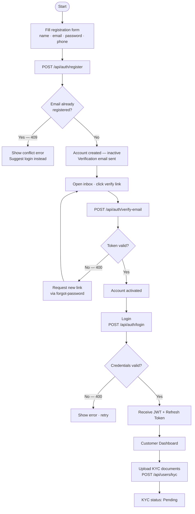

---

### 1.2 KYC Verification

**User story:** As a customer I want my identity documents reviewed so I am authorised to purchase policies.

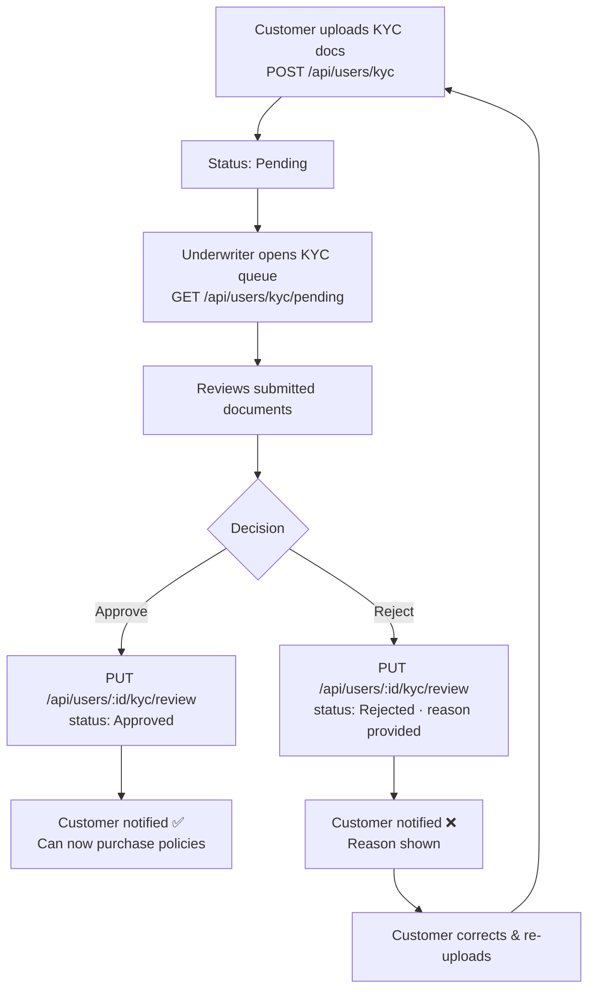

---

### 1.3 Buying a Policy

**User story:** As a customer I want to get a quote, submit a proposal, and receive a policy after underwriter approval.

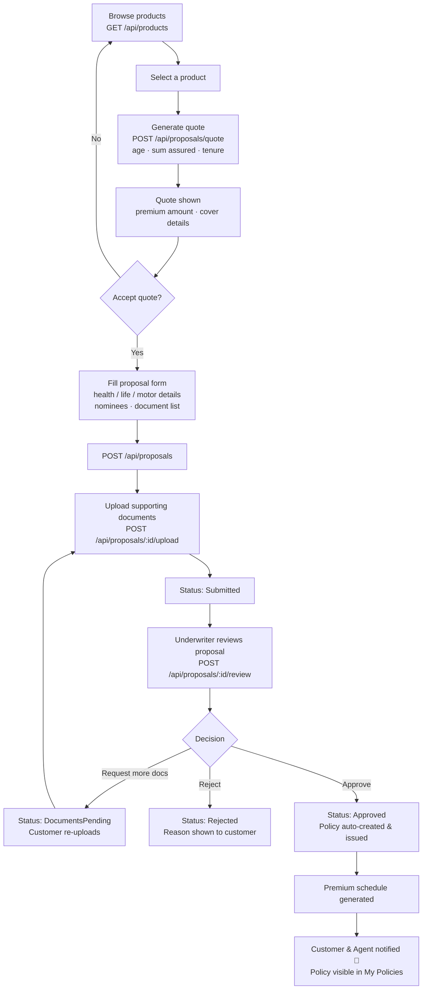

---

### 1.4 Paying Premiums

**User story:** As a customer I want to pay my premium installments online so my policy stays active.

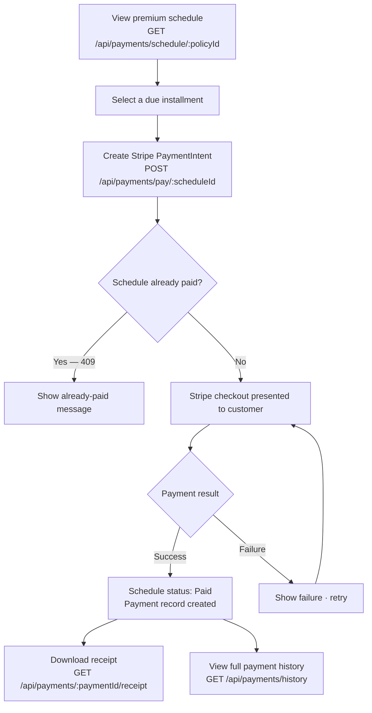

---

### 1.5 Filing a Claim

**User story:** As a customer I want to file an insurance claim and track it through to payout.

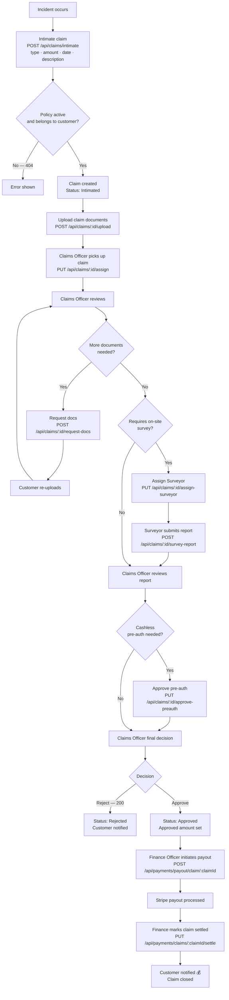

---

### 1.6 Raising a Grievance

**User story:** As a customer I want to raise a complaint and track its resolution status.

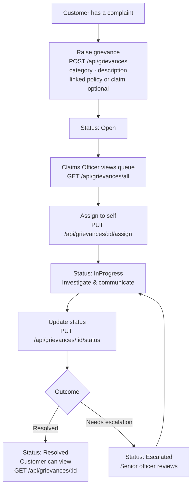

---

## 2. Agent Flows

### 2.1 Getting Started

**User story:** As a new agent I want to be onboarded by admin so I can start serving customers.

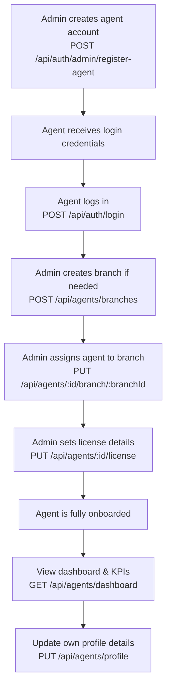

---

### 2.2 Submitting a Proposal for a Customer

**User story:** As an agent I want to submit insurance proposals on behalf of my customers so they can get covered.

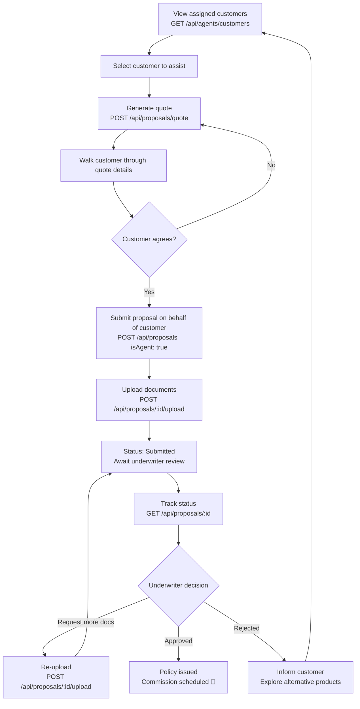

---

### 2.3 Tracking Renewals

**User story:** As an agent I want to see which policies are expiring soon so I can proactively contact customers.

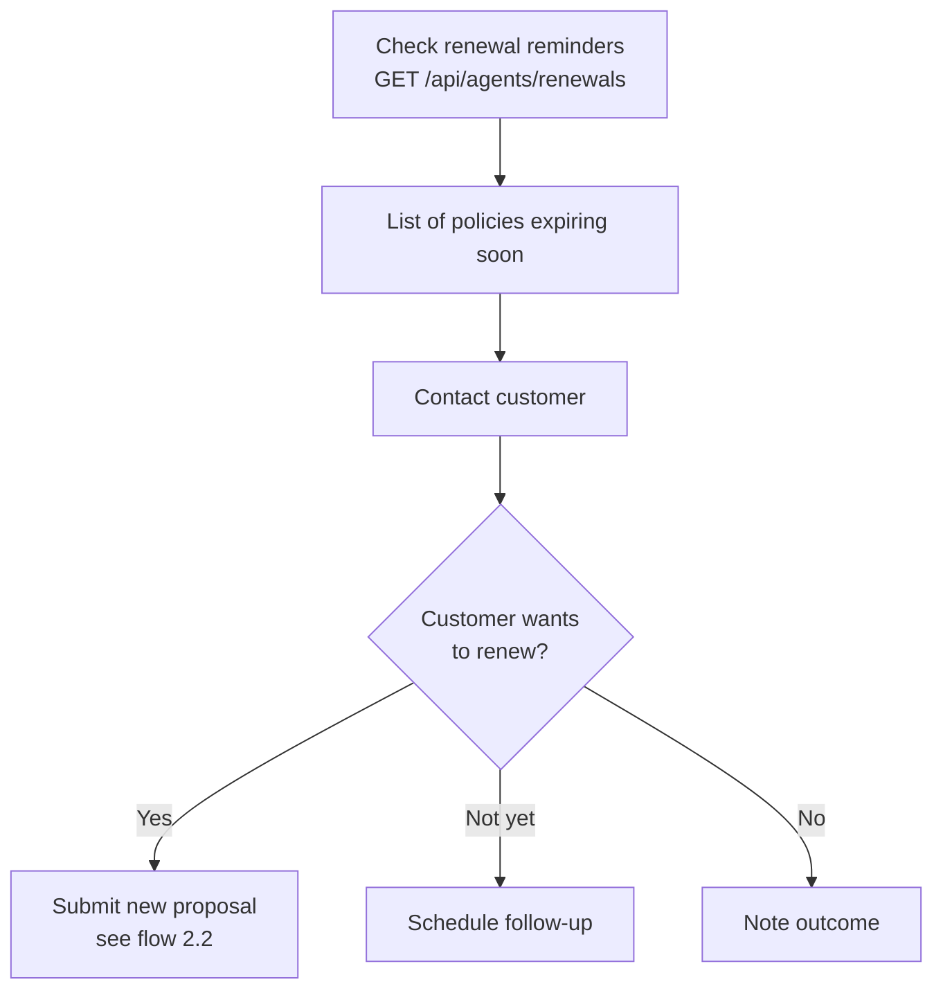

---

## 3. Admin & Underwriter Flows

### 3.1 Admin — User & Platform Management

**User story:** As an admin I want full control over users, agents, products, and system configuration.

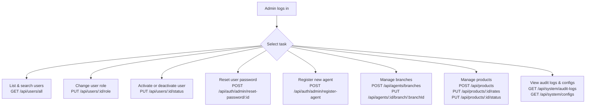

---

### 3.2 Underwriter — KYC Review

**User story:** As an underwriter I want to review customer identity documents so only verified customers can buy policies.

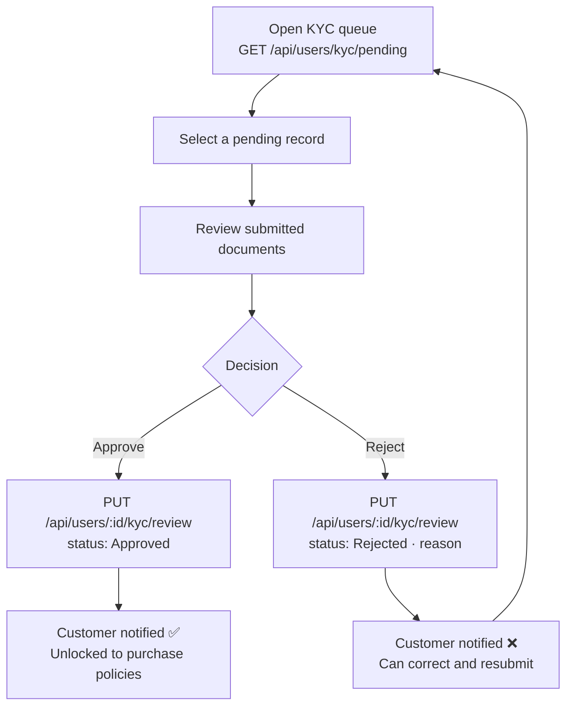

---

### 3.3 Underwriter — Proposal Review

**User story:** As an underwriter I want to evaluate submitted proposals and approve or reject them based on risk.

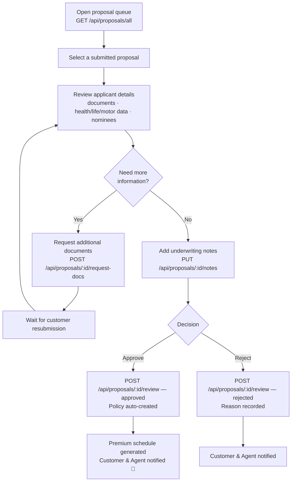

---

### 3.4 Underwriter — Endorsement Review

**User story:** As an underwriter I want to review and action policy change requests from customers.

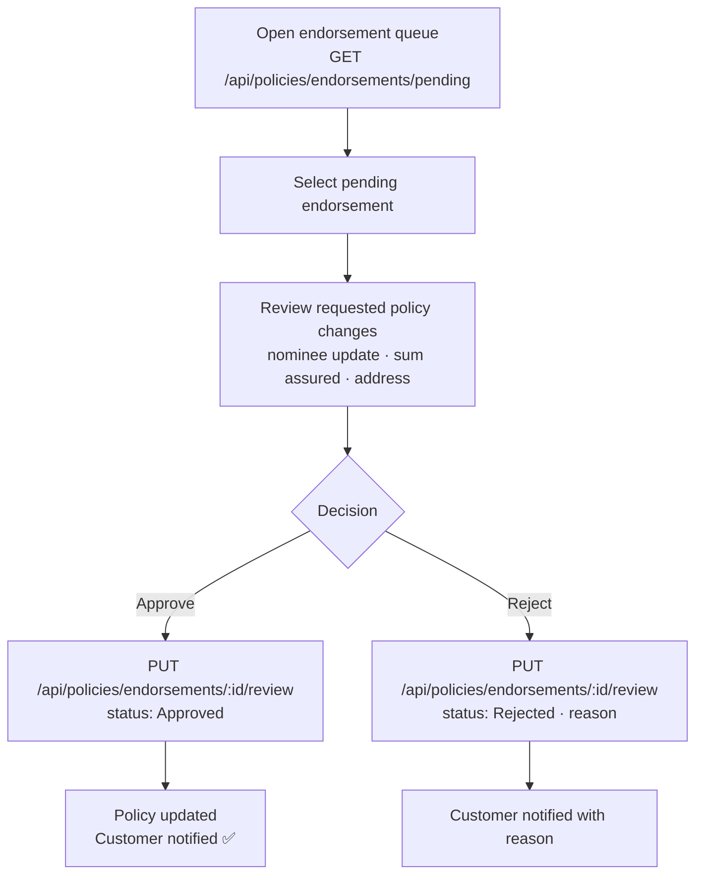

---

## 4. Claims Officer & Finance Officer Flows

### 4.1 Claims Officer — Processing a Claim

**User story:** As a claims officer I want to review, investigate, and adjudicate claims efficiently.

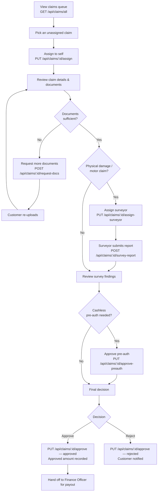

---

### 4.2 Finance Officer — Payout & Reconciliation

**User story:** As a finance officer I want to process claim payouts, reconcile payments, and manage agent commissions.

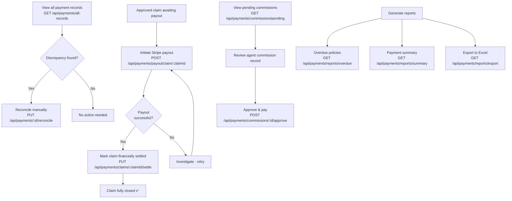

---

## 5. End-to-End Policy Lifecycle

> A single view of how all actors interact across the full life of a policy.

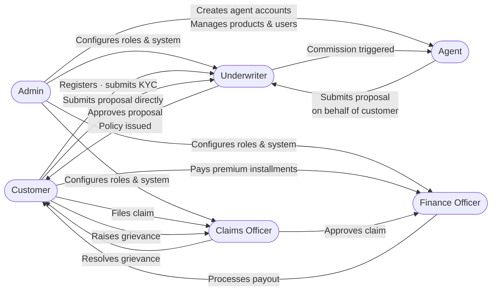
